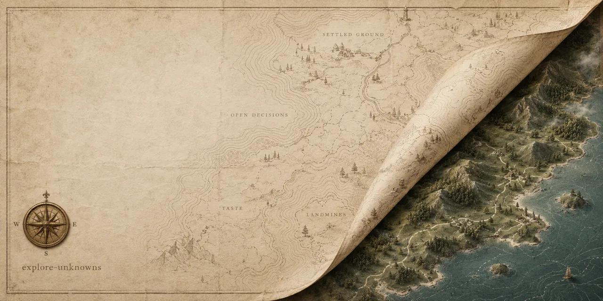

<p align="center">
  
</p>

# explore-unknowns

[](https://skills.sh/rhnfzl/explore-unknowns)
[](https://github.com/rhnfzl/explore-unknowns/releases)
[](LICENSE)

**Find and carry the unknowns before, during, and after implementation.**

## Quickstart (30 seconds)

One command, and it auto-detects your installed agents; that is the whole setup:

```bash
npx skills add rhnfzl/explore-unknowns
```

Then ask your agent to "explore the unknowns", "do a blindspot pass", or "interview me
about this change". Before a build, it walks you through a map of the task. During or
after a build, it starts from the current phase and carries the map forward without
replaying earlier stages.

<details>
<summary>Other install routes and manual use</summary>

- `npx openskills install rhnfzl/explore-unknowns` (AGENTS.md ecosystems)
- Claude Code natively: `/plugin marketplace add rhnfzl/explore-unknowns`, then `/plugin install explore-unknowns@rhnfzl`
- Manual: clone this repo and symlink it into your agent's skills directory (`~/.claude/skills/`, `~/.codex/skills/`, or `~/.agents/skills/`)

</details>

## Why this exists

The map is not the territory. Your prompt, your plan, and the context window are the map.
The codebase, the domain, and what you actually want are the territory. The gap between
them is the unknowns.

- **Unknowns are cheapest before code.** An assumption caught in a two-minute conversation
  costs two minutes. The same assumption caught three pull requests later costs the three
  pull requests.
- **You know more than you can say up front.** Reacting to a concrete option pulls out
  taste you cannot produce from a blank prompt. Concrete reactions replace blank-page
  interrogation. After artifact-tier work, a short quiz can verify that the important
  behavior and risks actually landed.
- **A plan you cannot read is not a plan.** The walk explains before it cites, defines its
  terms, and keeps file paths out of the prose. You finish holding a map you actually
  understand.

## Three phase-aware entrances

The skill starts from the phase you are actually in:

| Phase | What happens |
|---|---|
| **Pre-build** | Use the existing five-stage walk to build the full map before implementation starts. |
| **Mid-build** | Record deviations in a task-scoped implementation ledger, update the existing map, or create an honestly stamped partial map when no earlier map exists. |
| **Post-build** | Use a task-scoped explainer and quiz for artifact-tier work. Keep only low-risk internal work inline when none of the artifact-tier conditions apply. |

Post-build work is artifact-tier when merge readiness or stakeholder buy-in is requested,
the change crosses an architecture, data, security, cost, or user-visible boundary, or a
durable reviewer handoff is needed. Inline post-build work is only for low-risk internal
changes with none of those conditions. It stays a concise explanation with no formal
artifact or required quiz.

## One broad four-quadrant map

The walk fills in one map with four regions, one per kind of unknown:

| Quadrant | Plain name | What it holds |
|---|---|---|
| Known knowns | **Settled ground** | What the code and your notes already pin down. |
| Known unknowns | **Open decisions** | The questions you can name, resolved highest-stakes first. |
| Unknown knowns | **Taste** | The preferences you have but never wrote down. |
| Unknown unknowns | **Landmines** | The traps you would only find by stepping on them. |

Every discovery stays visible in this one map and receives exactly one plain priority
label: **Changes this task**, **Nearby finding**, or **Urgent outside scope**. Findings
that change the current task come first. The urgent label is reserved for serious
security or data-loss risk outside the task's scope.

## Pre-build: the five stages

The full pre-build entrance walks these in order, one at a time, so you always know where
you stand.

1. **Settled ground.** Scan the territory, capture the starting state, surface what is
   already decided.
2. **Open decisions.** One question at a time, highest-stakes first, each with a
   recommended answer you can override.
3. **Taste.** Probe only the preferences nobody has written down yet.
4. **Landmine sweep.** A fixed checklist of trap families, then a free sweep.
5. **The map.** Hand it over. The walk is done only when the map is in your hands.

Implementation remains a separate task. The skill maps and hands off unknowns before,
during, or after the work, but it does not perform the implementation itself.

## Task-scoped artifacts

Artifact filenames use the date, artifact kind, and a stable task slug:

- `YYYY-MM-DD-unknowns-map-<task>.html`
- `YYYY-MM-DD-implementation-notes-<task>.md`
- `YYYY-MM-DD-post-build-explainer-<task>.html`

Continuing the same task deliberately reuses its paths. If a path belongs to a different
task, the new task takes the next numeric suffix and reuses that suffixed slug across its
map, ledger, and explainer.

## What is in the box

| Path | What it is |
|---|---|
| `SKILL.md` | The portable spine: phase-aware entrances, the walk, its three moves, and its rules. |
| `references/` | One file per stage, plus an after-the-walk guide, read as each stage opens. |
| `territory.example.md` | Fill-in-the-blanks template for your own project profile. |
| `evals/evals.json` | Example prompts and the behavior each should produce. |

## Writing your own territory profile

The walk is domain-agnostic on its own. Everything specific to a project (which graph to
query, where maps get committed, which trap families to sweep, what the map feeds into)
lives in one optional file: `territory.md`.

Copy `territory.example.md` to `territory.md` next to the skill and fill in your project.
With a profile present, the walk uses it. With none, it runs as a plain general interview.
That is the whole extension mechanism: one swappable file, no config schema.

Your filled-in `territory.md` is gitignored by default, because it describes your own
workspace. Ship only the example.

## Trust

- No telemetry, no analytics, no phone-home.
- No executable code. The skill is Markdown plus one JSON file of evals; installing copies
  files, it does not run anything.
- No network calls. Any research the walk suggests uses your own agent's tools, under your
  control.
- Local by default. Maps are self-contained files in your workspace; sharing is an explicit
  act. See [SECURITY.md](SECURITY.md).

## Agent support

Any agent that loads a `SKILL.md` works: Claude Code, Codex, Cursor, and the rest of the
`npx skills` / `openskills` ecosystem. The walk delegates to sibling skills (grilling for
the interview, an HTML-artifact skill for committed maps, a research skill for deep dives)
when they are installed, and falls back to doing that work inline when they are not. It
degrades, it never stalls.

## Credits

Built on the map-and-territory framing and four kinds of unknown in Thariq
Shihipar's official article,
[A field guide to Claude Fable 5: Finding your unknowns](https://claude.com/blog/a-field-guide-to-claude-fable-finding-your-unknowns).

## License

MIT. See [LICENSE](LICENSE).
